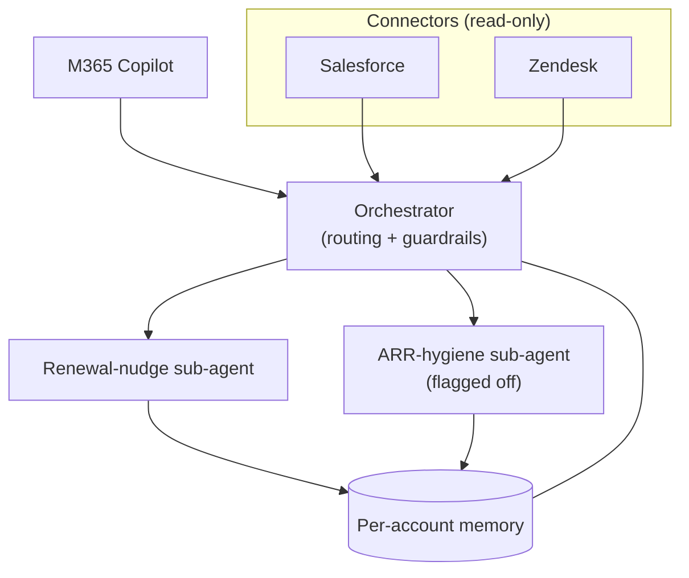

# Architecture

End-state architecture for Phase 1. **Locked** at the architecture review (AC-43). The Security threat model (AC-34) is sequenced to follow this lock, not precede it.

## End-state diagram

## Components

- **Orchestrator** — receives normalized `CustomerSignal`s, routes to a sub-agent, enforces grounding guardrails.
- **Sub-agents** — renewal-nudge (live), ARR-hygiene (flagged off pending eval).
- **Connectors** — Salesforce + Zendesk, **read-only** adapters behind per-connector feature flags.
- **Memory** — per-account only.

## Phase 1 boundaries (locked)

- Connectors are **read-only** — no write-back to customer systems.
- **Two** connectors only: Salesforce + Zendesk.
- Memory is **per-account** (no cross-account memory).
- Every drafted action is **grounded in a cited signal**; a human CSM reviews before anything is sent.

## Rollback

Feature flag per **connector** and per **capability slice** — any connector or capability can be disabled independently without redeploy.
